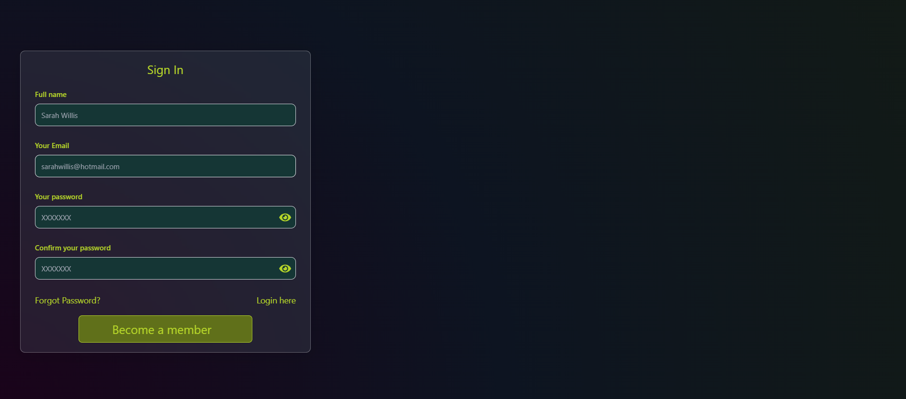
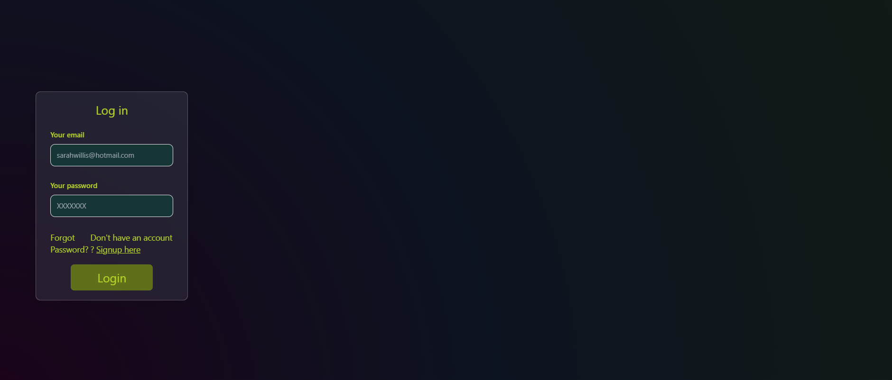

# GetflixProject (Cinémania) branch signup

## Description

Bienvenue dans ma branche Signup où je suis entrain de créer la page d'enrigstrement de l'user, ainsi que la page de login quand cet utilisateur aura déjà créer son compte. J'essaye de respecter le dribble qu'on a choisi (style et couleurs). Pas encore fini mais en cours

## Aperçu :camera:

Accéder au site en direct en cliquant [ici](https://zanko19.github.io/api-nasa/)

## Technologies Utilisées :gear:

Ce projet utilise la technologie suivante :

- React
- Vite
- Tailwind

## Développement en Local :computer:

Pour lancer le projet localement sur votre machine, suivez ces étapes :

1. Clonez ce dépôt : `https://github.com/A3lequenne/getflixProject.git`
2. Accédez au répertoire du projet : `cd getflixProject/frontend`
3. Installez les dépendances : `npm install`
4. Lancez le projet : `npm run dev`

Assurez-vous d'avoir [Node.js](https://nodejs.org/) installé sur votre machine.

## Problèmes Connus :warning:

Difficulté à assimiler 2 nouvelles technologies pour ce projet, cela prend du temps pour ne pas aller trop vite et comprendre ce que je fais.

## © Guillaume Dedeurwaerder © 
### :calendar: 05/12/2023

