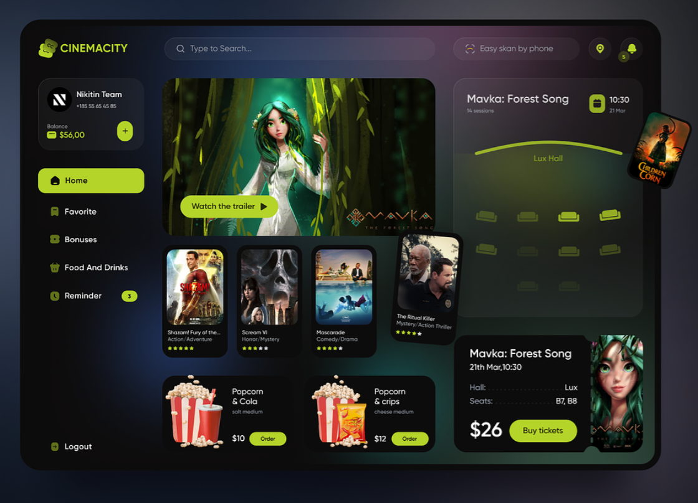
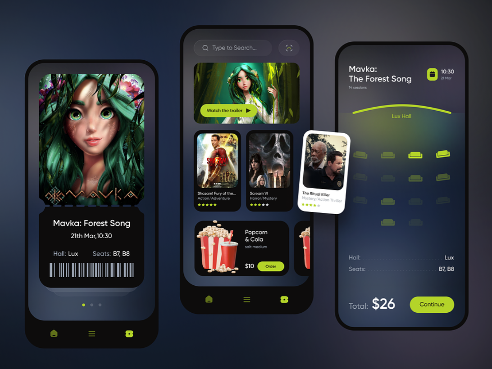
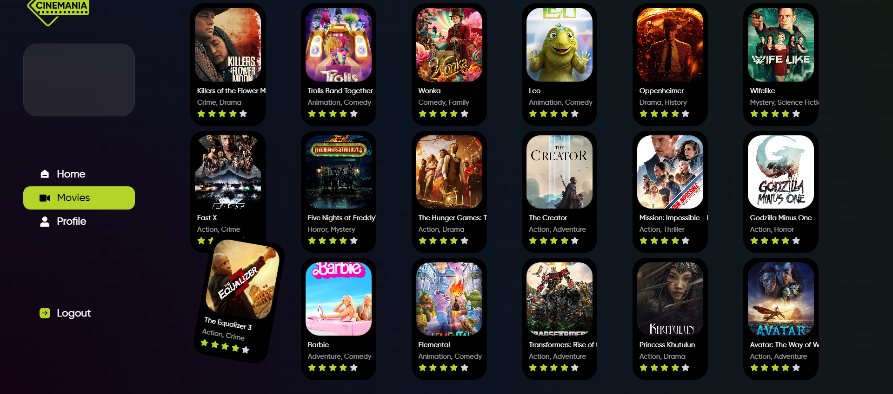

[![Contributors][contributors-shield]][contributors-url]
Accéder au site en direct en cliquant [ici](https://a3lequenne.github.io/getflixProject/#/)
# :film_strip:CINÉMANIA:film_strip:

## Description🎦

Embark on an immersive cinematic journey with Cinemania, a meticulously crafted cinema-centric website developed in 15 days. Inspired by a themed cinema design on Dribbble, Cinemania offers more than just streaming, providing an enriching experience for movie enthusiasts. With secure user authentication, an intuitive interface, and essential features like search filters, Cinemania ensures a seamless exploration of curated cinematic content. Deployed successfully using alternative technologies, Cinemania brings the world of cinema to your fingertips. 👈

## Inspiration 💡

## Aperçu 📷

## Technologies Utilisées ⚙️

Ce projet utilise les technologie suivantes :

* [![Tailwind-css][Tailwind]][React-url]
* [![React][React.js]][React-url]
* [![Vite][Vite.js]][Vite-url]
* [![Node][Node.js]][Node-url]
* [![MangoDB][MangoDB]][Mango-url]

## Développement en Local 💻

Pour lancer le projet localement sur votre machine, suivez ces étapes :

1. Clonez ce dépôt : `git clone https://github.com/A3lequenne/getflixProject.git`
2. Accédez au répertoire du projet : `cd getflixProject`
3. Installez les dépendances : `npm install`
4. Lancez le projet : `npm start`

Assurez-vous d'avoir [Node.js](https://nodejs.org/) installé sur votre machine.

## Problèmes Connus ⚠️

Work in progress

# ©
##  Onisim Rusu
## Julia Michel Teixeira
## Clément Lequenne 
## Guillaume Dedeurwaerder
# © 
### 📆 19/12/2023

[contributors-shield]: https://img.shields.io/github/contributors/a3lequenne/getflixProject.svg?style=for-the-badge
[contributors-url]: https://github.com/a3lequenne/getflixProject/graphs/contributors
[React.js]: https://img.shields.io/badge/React-20232A?style=for-the-badge&logo=react&logoColor=61DAFB
[React-url]: https://reactjs.org/
[Vite.js]: https://img.shields.io/badge/Vite.js-20232A?style=for-the-badge&logo=vite.js&logoColor=61DAFB
[Vite-url]: https://vitejs.dev/
[Tailwind]: https://img.shields.io/badge/Tailwind-20232A?style=for-the-badge&logo=Tailwind&logoColor=61DAFB

[Node.js]: https://img.shields.io/badge/Node.js-20232A?style=for-the-badge&logo=Node.js&logoColor=61DAFB
[Node-url]: https://nodejs.org/en
[MangoDB]: https://img.shields.io/badge/MangoDB-20232A?style=for-the-badge&logo=MangoDB&logoColor=61DAFB
[Mango-url]: https://www.mongodb.com/fr-fr/cloud/atlas/lp/try4
